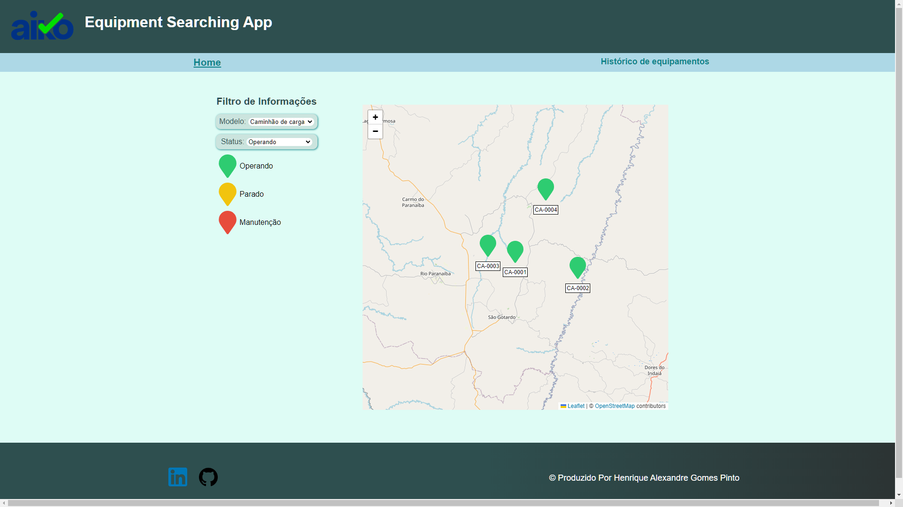
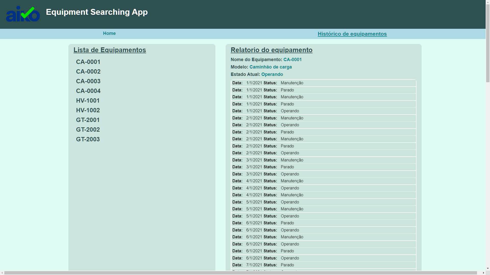

## Objetivo do Projeto
 O objetivo principal do projeto é entregar um sistema de consulta de equipamentos que seja rápido e de fácil interação, para obter uma experiencia satisfatória do usuário e com alta responsividade.

## Principais ferramentas
 O sistema foi desenvolvido com JavaScript utilizando o frameWork React para uma navegação mais rapida e fluida, foram utilizadas as bibliotecas React-router para uma transição responsiva entre as páginas, o Redux para um controle de estados globais, o Sass para auxiliar na estilização do sistema, o leaflet para implementar a interação relacionada ao mapae o lint para captação de erros e melhora do codigo.

## Requisitos Funcionais  

A tabela a seguir apresenta os requisitos funcionais do projeto, identificando a prioridade em que os mesmos devem ser entregues. 

| ID     | Descrição do Requisito                  | Prioridade |
| ------ | --------------------------------------- | ---------- |
| RF-001 | O sistema deve exibir todos os equipamentos cadastrados.  | ALTA       |
| RF-002 | O sistema deve exibir no mapa todos  os equipamentos suas posições mais recentes | ALTA      |
| RF-003 | Deverá ser exibido mo mapa o estado atual dos equipamentos.| ALTA      |
| RF-004 | O sistema deverá aprensentar o histórico de estados de um equipamento especifico. | ALTA      |
| RF-005 |  O sistema deve filtrar visualizações por modelo ou estado atual  | MÉDIA      |
| RF-006 | O sistema deve gerar relatorio sobre um equipamento especifico   | MÉDIA      |
| RF-007 | O sistema deverá diferenciar a exibição de cada estado do equipamento no mapa  | MÉDIA    |
 

### Requisitos não Funcionais

A tabela a seguir apresenta os requisitos não funcionais que o projeto deverá atender. 

| ID      | Descrição do Requisito                                            | Prioridade |
| ------- | ----------------------------------------------------------------- | ---------- |
| RNF-001 | O sistema deve funcionar nos principais navegadores do mercado (Chrome, Firefox, Edge, Brave...)  | ALTA      |
| RNF-002 | O sistema deve ser responsivo em e desktop/notebook  | ALTA |
| RNF-003 | O tempo de carregamento da página deve ser menor que 2 segundos em 90% dos casos  | MÉDIA      |
| RNF-004 |  O tempo de carregamento de pesquisas e filtros do sistema deve ser menor que 2 segundos em 90% dos casos  | MÉDIA |
| RNF-005 | O tempo de geração de relatório deve ser menor que 30 segundos em 90% dos casos  | MÉDIA |

## Restrições

As questões que limitam a execução desse projeto e que se configuram como obrigações claras para o desenvolvimento do projeto em questão são apresentadas na tabela a seguir. 

| ID  | Restrição                                             |
| --- | ----------------------------------------------------- |
| RE-01   | O projeto deverá ser entregue até dia 29 de março de 2022 até as 16:00 horas  |
| RE-02   | O projeto deve ser totalmente produzido por Henrique Alexandre Gomes Pinto
|

## Interface do sistema

*Imagem da página principal do sitema*

*Imagem da página de relatorio do sistema.*

## Diagrama de Casos de Uso

Segue na imagem abaixo o diagrama de caso de uso que retrata de forma abstrata as principais funções a serem desenvolvidas pelo sistema, demonstrando a interação entre o usuário (ator) e o sistema. 

*O diagrama foi criado utilizando a ferramenta de edição no site LucidChart.*
