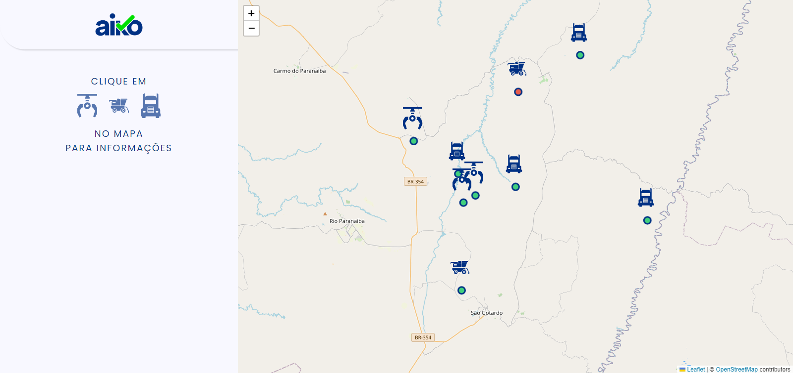
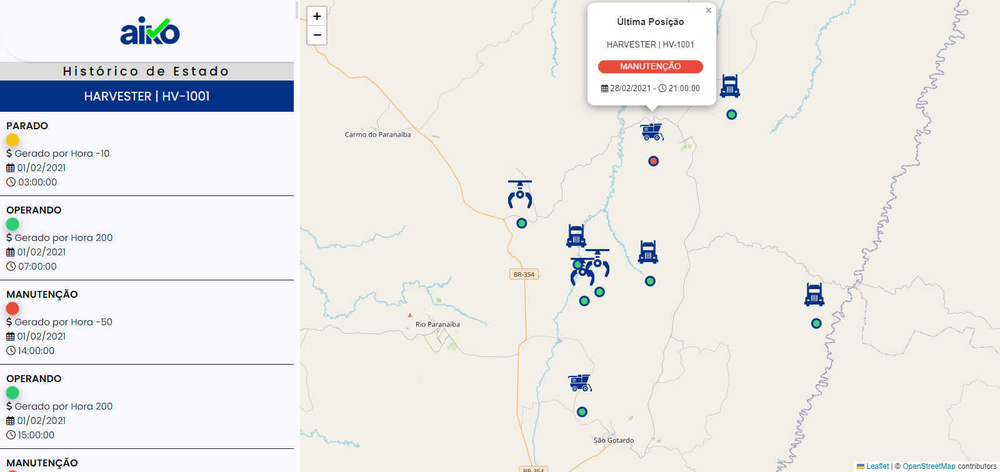

# Teste Frontend estágio V3

Neste teste serão avaliados seus conhecimentos em Javascript, HTML e CSS, a criatividade e metodologia aplicada no desenvolvimento, a usabilidade e design da aplicação final.

## O Desafio

Você é o desenvolvedor frontend de uma empresa que coleta dados de equipamentos utilizados em uma operação florestal. Dentre esses dados estão o histórico de posições e estados desses equipamentos. O estado de um equipamento é utilizado para saber o que o equipamento estava fazendo em um determinado momento, seja *Operando*, *Parado* ou em *Manutenção*. O estado é alterado de acordo com o uso do equipamento na operação, já a posição do equipamento é coletada através do GPS e é enviada e armazenada de tempo em tempo pela aplicação.

Seu objetivo é, de posse desses dados, desenvolver o frontend de aplicação web que trate e exibida essas informações para os gestores da operação.

## Requisitos

Esses requisitos são obrigatórios e devem ser desenvolvidos para a entrega do teste.

* **Posições dos equipamentos**: Exibir no mapa os equipamentos nas suas posições mais recentes.

* **Estado atual do equipamento**: Visualizar o estado mais recente dos equipamentos. Exemplo: mostrando no mapa, como um pop-up, mouse hover sobre o equipamento, etc.

* **Histórico de estados do equipamento**: Permitir a visualização do histórico de estados de um equipamento específico ao clicar sobre o equipamento.

## Entrega do Teste

### [**Deploy**](https://teste-aiko-jeansilva.netlify.app)

## Screenshots

## Tech

* **HTML**
* **CSS**
* **JAVASCRIPT**
* **LEAFLET**

