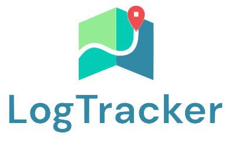

# Teste Frontend estágio V3



A proposta foi elaborada e nomeada como LogTacker. A Plataforma possui um designe simples e responsivel, permitindo a navegação através de dispositivos com diferentes tamanhos de tela.

## Requisitos Obrigatórios

* **Posições dos equipamentos**: Exibir no mapa os equipamentos nas suas posições mais recentes. ✔️

* **Estado atual do equipamento**: Visualizar o estado mais recente dos equipamentos. Exemplo: mostrando no mapa, como um pop-up, mouse hover sobre o equipamento, etc. ✔️

* **Histórico de estados do equipamento**: Permitir a visualização do histórico de estados de um equipamento específico ao clicar sobre o equipamento. ✔️


## Tecnologias utilizadas

* React.

* Leaflet API.


## Extras

Aqui são listados algumas funcionalidades extras implementadas.

* **Filtros**: Filtrar as visualizações por estado atual;

* **Pesquisa**: Ser possível pesquisar ou selecionar a trajetória de um equipamento específico;

* **Diferenciar os estados dos equipamentos**: Diferenciar visualmente os estados equipamentos pelas cores indicativas na visualização do mapa;

* **Histórico de posições (Trajetória)**: Que seja possível visualizar o histórico de posições de um equipamento, mostrando o trajeto realizado por ele;

* **Download do histórico de estados**: Permite que o usuário realize o download do histórico de posições de um equipamento específico em formato **.pdf** ou **.csv**.


## Intruções de acesso

Para baixar todas dependências e iniciar o servidor local, execute:
```
npm run first-start
```

Acesse o projeto em seu navegador através do endereço http://localhost:3000.

Ou entre em https://ephemeral-pony-475e21.netlify.app, para visualizar a plataforma.


